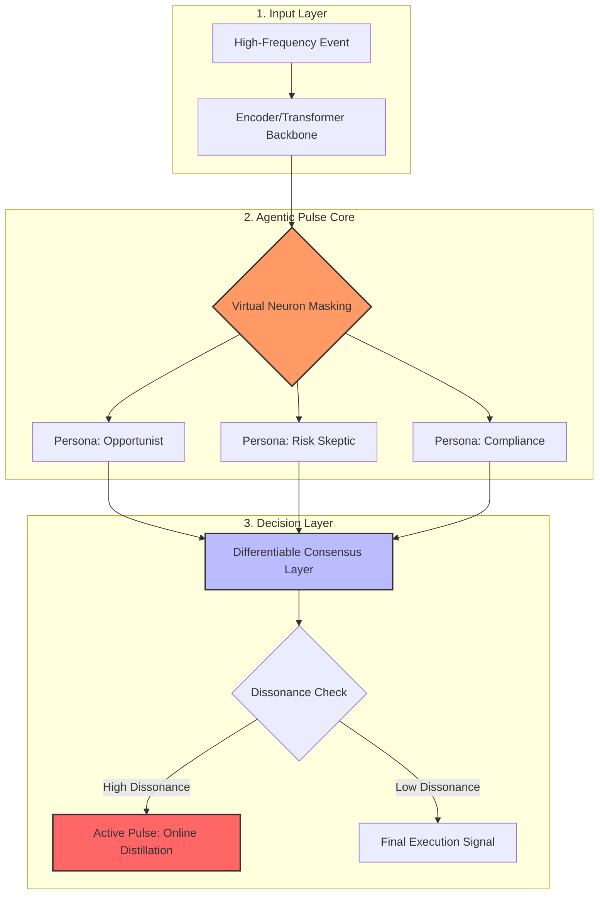

# Agentic Pulse: Dynamic Neural Resonance

Agentic Pulse is a next-generation framework designed to bridge the gap between **Multi-Agent Intelligence** and **Single-Agent Latency**. 

Unlike Agentic Distillation (e.g., AgentArk), which freezes multi-agent logic into static weights, **Agentic Pulse** uses **Virtual Neuron Masking** to allow a single model to "argue" with itself internally in a single forward pass.

## Key Innovations
- **Virtual Neuron Masking (VNM):** On-the-fly partitioning of hidden states into Expert Personas.
- **Differentiable Consensus:** Mathematical resolution of logical clashes before token generation.
- **Active Pulse:** Continuous, online weight updates triggered by high internal dissonance.

## Performance
- **Latency:** ~40ms (Single-pass)
- **Accuracy:** Comparable to a 5-agent debate cluster.
- **Cost:** 90% reduction in token overhead.

## Installation

```bash
pip install -r requirements.txt
```

## Quick Start

Run the high-stakes audit example:

```bash
python examples/high_stakes_audit.py
```

## Architecture

```
agentic-pulse/
├── pulse_engine/
│   ├── __init__.py
│   ├── activations.py   # Virtual Neuron Masking (VNM)
│   ├── consensus.py     # Differentiable Consensus Layer
│   └── online_sft.py    # Active Pulse (Real-time LoRA)
├── examples/
│   └── high_stakes_audit.py
├── README.md
└── requirements.txt
```

## System Flow Diagram



## License

MIT